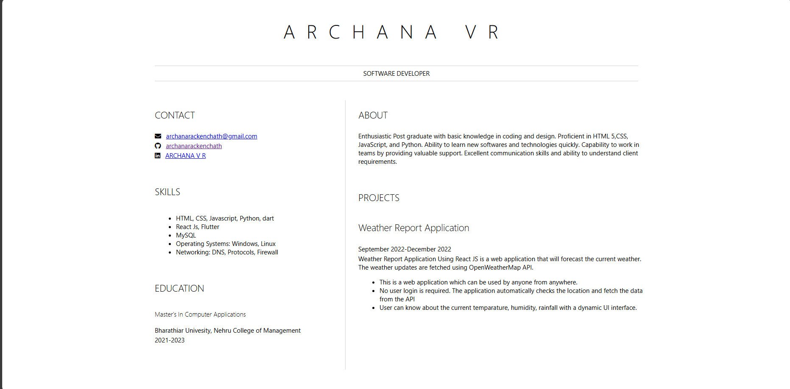

# Resume
A simple personal resume which is developed using HTML and CSS

## How to Use

1. Clone the repository:
    ```bash
    git clone https://github.com/archanarackenchath/Resume.git
    ```
2. Navigate to the project directory:
    ```bash
    cd Resume
    ```
3. Open the `index.html` file in your web browser to view the resume.

## Screenshot



## Technologies Used

- HTML
- CSS
- Font Awesome